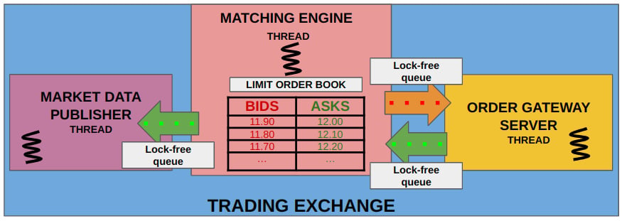

 Exchange HFT Simulator

A high-frequency trading (HFT) exchange simulator designed using modern C++

I built this project to understand and implement the **core components of an exchange system** including matching engines, low-latency market data feeds, and efficient system design under real-time constraints.

This project simulates a realistic environment to experiment with:
- Order book management
- Order matching logic
- Socket-based communication (TCP/UDP)
- Core pinning, lock-free structures, and low-latency design patterns

 Tech Stac

| Area               | Technologies Used                              |
|--------------------|-------------------------------------------------|
| Language           | C++17                                           |
| Networking         | TCP, UDP, POSIX sockets                         |
| Messaging Queue    | Kafka                                           |
| In-memory Storage  | Redis                                           |
| OS/Performance     | Linux, `sched_setaffinity`, `perf`, `valgrind` |
| Multithreading     | `std::thread`, `mutex`, thread pools            |
| Build Tool         | `CMake`, `Makefile`                             |

 Features Implemented

-  Multithreaded matching engine with configurable instruments  
-  Order types: limit, market, cancel  
-  TCP/UDP-based socket communication for order submission and market data  
-  Redis integration for in-memory order book  
-  Kafka stream publishing for matched trades  
-  Core pinning and thread affinity to reduce latency  
-  Lock minimization and concurrency optimization  

